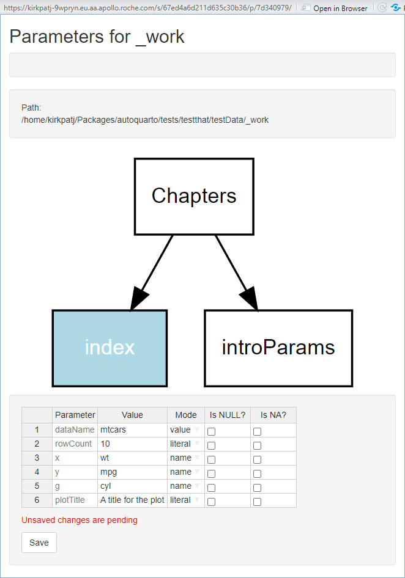

<!-- README.md is generated from README.Rmd. Please edit that file -->

# autoquarto

<!-- badges: start -->

[](https://CRAN.R-project.org/package=autoquarto)
[](https://lifecycle.r-lib.org/articles/stages.html#experimental)
[](https://github.com/openpharma/autoquarto/blob/_xml_coverage_reports/data/main/coverage.xml)<!-- badges: end -->

The goal of autoquarto is to provide tools to allow the programmatic,
incremental definition and publication of Quarto reports.

`autoquarto` is very much a work in progress, and is being developed in
parallel with the [`rbqmR`](https://openpharma.github.io/rbqmR/main/)
package. It is also being used in shinyCrmPack, a Shiny front-end to the
[crmPack](https://github.com/Roche/crmPack) package. As `rbqmR` and
`shinyCrmPack` evolve, so will `autoquarto`.

## Installation

You can install the development version of `autoquarto` from
[GitHub](https://github.com/) with:

``` r
# install.packages("devtools")
devtools::install_github("openpharma/autoquarto")
```

`autoquarto` is not currently available on CRAN.

## Introduction

The fundamental class used by `autoquarto` is the S4 `QuartoObject`
class, together with its sub-classes, `QuartoDocument`,
`QuartoCompoundObject`, `QuartoBook` and `QuartoWebsite`. The class
hierarchy looks like this:

    #> └── QuartoObject:
    #>     └── QuartoDocument
    #>     └── QuartoCompoundDocument:
    #>         └── QuartoBook
    #>         └── - QuartoWebsite

The `QuartoObject` class has a single slot, `variables`.
`QuartoCompoundObject` introduces three more slots, named
`templateSearchPath`, `chapters` and `type`, whereas the
`QuartoDocument` class introduces a single new slot, `fileName`.

### Compound Quarto objects

- The `chapters` slot contains the names of the files that define the
  chapters, or sections, of the compound document. Each file defines a
  single chapter. If the chapter is of the form
  `<filename>.<extension>`, for example `introduction.qmd`, the folders
  defined by `templateSearchPath` are searched, in order, and the first
  matching file is used. This process allows a hierarchy of templates to
  be used. If the chapter file is provided as an absolute or relative
  path, then the `templateSearchPath` is not used. The file used is file
  in the precise location given.
- The `templateSearchPath` slot lists the folders that are searched, in
  order, to find the `chapter` files.
- The `variables` slot will be used to pass parameters to chapter files
  in a future version of `autoquarto`. It is not currently used.
- The `type` slot defines the type of quarto object (eg `book` or
  `website`) that is being built. The value is set, internally, by the
  object’s constructor.

#### Using the `templateSearchPath` hierarchy

Suppose a company provides global templates for components of reports at
in a folder named `~/templates/gobal`. Some of these global templates
are named `index.qmd`, `conclusion.qmd` and `environment.qmd`. A project
team has created project specific templates named `conclusion.qmd`,
`main_body.qmd` and `intro.qmd` in a folder named
`~/templates/projectA/`. The project team is a running study named
`study1` and has a provided study specific version of `intro.qmd` in
`~/templates/projectA/study1`. By default, the global template should be
used. However, if a project-level version of a template has been
provided, then that should be used instead of the global version.
Similarly, a study-level template should override both a global or
project-level template.

This situation can be handled by setting the `templateSearchPath` slot
to

    list("~/templates/projectA/study1", "~/templates/projectA/", "~/templates/gobal")

If the `chapters` slot has the value

    list(
      "index.qmd", 
      "intro.qmd", 
      "main_body.qmd", 
      "conclusion.qmd", 
      "environment.qmd", 
      "~/specialReports/appendix3.qmd"
    )

Then

- `index.qmd` will be taken from `~/templates/gobal`
- `intro.qmd` will be taken from `~/templates/projectA/study1`
- `main_body.qmd` will be taken from `~/templates/projectA/`
- `conclusion.qmd` will be taken from `~/templates/projectA/`
- `environment.qmd` will be taken from `environment.qmd`
- `~/specialReports/appendix3.qmd` will be used as is

There is effectively no limit to the number of entries in the
`templateSearchPath`.

## Defining `QuartoObject`s

`autoquarto` defines constructors for each of its classes, though
`QuartoCompoundObject`s will rarely be used directly. Every class has a
no-argument constructor:

    myBook <- QuartoBook()
    myWebsite <- QuartoWebsite()
    myDocument <- QuartoDocument()

For `QuartoCompoundObjects`, the `templateSearchPath` and `chapter`
slots can be set when calling the constructor

    myBook <- QuartoBook(
                templateSeachPath = list("~/templates/projectA/study1", "~/templates/projectA/", "~/templates/gobal"),
                chapters=list("index.qmd", "body.qmd", "conclusion.qmd")
              )

After initial creation of the object, entries can be added to each slot
with the `addTemplateSearchPath` and `addChapter` methods.

    myBook <- addTemplateSearchPath(x, "~/templates/gobal")
    myBook <- addChapter("environment.qmd")

Similarly, the `fileName` slot of `QuartoDocument`s can be set by the
constructor, or by accessing the slot directly:

    myDocument <- QuartoDocument("myTemplateFile.qmd")

is equivalent to

    myDocument <- QuartoDocument()
    myDocument@fileName <- "myTemplateFile.qmd"

All `QuartoObject` methods support piping. The definition of `myBook`
above is equivalent to

    library(magrittr)

    myBook <- myBook %>% 
                addTemplateSearchPath(x, "~/templates/gobal") %>% 
                addChapter("environment.qmd")

By default, the `addXXXX`methods add new entries at the end of the
current list, but the `.after` parameter can be used to insert the new
entry at a different position in the list:

    myBook <- myBook %>% addChapter("~/specialReports/appendix3.qmd", .after=2)

Existing elements of the list can be deleted with the appropriate
`removeXXXX` method. The following code returns `myBook` to its initial
state:

    myBook <- myBook %>% 
                removeTemplateSearchPath(x, "~/templates/gobal") %>% 
                removeChapter("environment.qmd") %>% 
                removeChapter("~/specialReports/appendix3.qmd")

## Publishing `QuartoObject`s

Once the methods discussed above have added the necessary information to
a `QuartoObject`, it can be published by calling the `publish` method.

    publish(myBook)

or

    publish(
      QuartoBook(
        templateSearchPath=list(testthat::test_path("testData", "global")),
        chapters=list(
          "index.qmd",
          testthat::test_path("testData", "testParams", "introParams.qmd")
        )
      ),
      outFile="testParamsOutput",
      workDir=testthat::test_path("testData", "_work"),
      params=list(
        dataName="mtcars",
        rowCount=10,
        x="wt",
        y="mpg",
        g="cyl",
        plotTitle="A title for the plot"
      )
    )

or

    publish(
      QuartoDocument(testthat::test_path("testData", "testParams", "introParams.qmd")), 
      outFile="testParamsOutputDocument", 
      workDir=testthat::test_path("testData", "_work"),
      params=params
    )

`publish`ing a `QuartoObject` also creates a log file (by default, in
the same folder as `outFile`) describing what actions were taken by the
`publish` method. The log file has the same base name as the `outFile`
with a timestamp appended. For example, in the code above, the log file
might be named `testReport_2023-03 Mar-07_141858.log`.

The detail and format of the messages in the log file can be controlled
using standard calls to `futile.logger` functions, for example;

    futile.logger::flog.threshold(futile.logger::DEBUG)
    futile.logger::flog.layout(futile.logger::layout.format("~t ~l ~n ~f: ~m"))
    futile.logger::flog.appender(futile.logger::appender.console()) 

and the content of a typical log file could be similar to

    2023-03-07 14:18:59 INFO [autoquarto:publish]: workDir [tests/testthat/testData/_work] is not empty.  Deleting current contents...
    2023-03-07 14:18:59 INFO [autoquarto:publish]: Processing chapter files...
    2023-03-07 14:18:59 INFO [autoquarto:publish]: Processing index.qmd...
    2023-03-07 14:18:59 DEBUG [autoquarto:publish]: Copying '/home/kirkpatj/Packages/autoquarto/tests/testthat/testData/global/index.qmd' to 'tests/testthat/testData/_work'...
    2023-03-07 14:18:59 DEBUG [autoquarto:publish]: Updating parameter YAML block...
    2023-03-07 14:18:59 DEBUG [autoquarto:publish]: Done
    2023-03-07 14:18:59 INFO [autoquarto:publish]: Processing tests/testthat/testData/testParams/introParams.qmd...
    2023-03-07 14:18:59 DEBUG [autoquarto:publish]: Copying '/home/kirkpatj/Packages/autoquarto/tests/testthat/testData/testParams/introParams.qmd' to 'tests/testthat/testData/_work'...
    2023-03-07 14:18:59 DEBUG [autoquarto:publish]: Updating parameter YAML block...
    2023-03-07 14:18:59 DEBUG [autoquarto:publish]: Done
    2023-03-07 14:18:59 INFO [autoquarto:publish]: Processing _quarto.yml...
    2023-03-07 14:18:59 INFO [autoquarto:publish]: Writing _quarto.yml
    2023-03-07 14:19:00 DEBUG [autoquarto:publish]: _quarto.yml is:
    2023-03-07 14:19:00 DEBUG [autoquarto:publish]: project:
    2023-03-07 14:19:00 DEBUG [autoquarto:publish]:   type: book
    2023-03-07 14:19:00 DEBUG [autoquarto:publish]:   output-dir: /home/kirkpatj/Packages/autoquarto
    2023-03-07 14:19:00 DEBUG [autoquarto:publish]: book:
    2023-03-07 14:19:00 DEBUG [autoquarto:publish]:   title: What is the title?
    2023-03-07 14:19:00 DEBUG [autoquarto:publish]:   author: Who Is The Author
    2023-03-07 14:19:00 DEBUG [autoquarto:publish]:   date: '2023-04-13 at 2023-04-13 13:07:16 on rstudio-deployment-kirkpatj-9wpryn-fbfcdcc7-ftxf9'
    2023-03-07 14:19:00 DEBUG [autoquarto:publish]:   chapters:
    2023-03-07 14:19:00 DEBUG [autoquarto:publish]:   - index.qmd
    2023-03-07 14:19:00 DEBUG [autoquarto:publish]:   - introParams.qmd
    2023-03-07 14:19:00 DEBUG [autoquarto:publish]: format:
    2023-03-07 14:19:00 DEBUG [autoquarto:publish]:   html:
    2023-03-07 14:19:00 DEBUG [autoquarto:publish]:     theme: cosmo
    2023-03-07 14:19:00 DEBUG [autoquarto:publish]:   pdf: default
    2023-03-07 14:19:00 DEBUG [autoquarto:publish]: 
    2023-03-07 14:19:00 INFO [autoquarto:publish]: Rendering report...
    2023-03-07 14:19:22 INFO [autoquarto:publish]: Done

## YAML parameters in multi-file Quarto documents

Unfortunately, Quarto support for YAML parameters in multi-file renders
is currently not great. There is no way to create a “central” definition
of YAML parameters. Instead, the YAML parameters must be repeated at the
start of each and every chapter file.

> See
> [here](https://stackoverflow.com/questions/72992071/specifying-parameters-in-yml-file-for-quarto)
> for more details.

In addition, if a chapter file is passed a `params` list that contains
one or more entries that do not exist in the file’s own YAML header, an
error occurs.

Finally, another issue is that each chapter file is rendered in its own
environment. This means that intermediate results derived in an earlier
chapter are not available to the current chapter, unless the derivation
is repeated or new parameters enabling the derived data to be imported
are provided.

Passing data frames and other complex R objects to a Quarto file as YAML
parameters needs a little thought. There are two ways of doing it.
First, as in the examples above, the name of object can be passed as a
parameter to the file. For example:

``` r
myData <- tibble(x = 1:2, z = LETTERS[x])
```

    ---
    params:
      df: myData
    ---

In which case, the data frame can be accessed within the template file
using

    df <- get(params$df)

Alternatively, you can convert the data frame to a list, and then to
YAML:

``` r
ymlthis::yml_empty() %>% ymlthis::yml_params(df = ymlthis::as_yml(myData))
#> ---
#> params:
#>   df:
#>     x:
#>     - 1
#>     - 2
#>     z:
#>     - A
#>     - B
#> ---
```

In this case, the data frame can be accessed directly within the
template file, (though it may need to be cast back into a data frame for
some functions to work as expected).

    df <- as.data.frame(params$df) 

Obviously, if the data frame is large, this approach will make the YAML
header quite lengthy.

### Notes

- Quarto books and Quarto websites *must* include an `index.qmd` file.
  This is a limitation of Quarto. See
  [here](https://github.com/quarto-dev/quarto-cli/discussions/4024) for
  more information.
- `output-file` affects only single-file destinations such as PDF. It is
  ignored for multi-file destinations such as html. For multi-file
  destinations, the project main file is always (eg) index.html.

## Interactively querying YAML parameters

`autoquarto` includes an app that allows users to provide definitions
for parameters in the YAML header of a Quarto document (or in the
headers of individual chapters of a Quarto book or website). The easiest
way to access the website is by calling the `askForParams` function:

    askForParams <- function(path="path/to/myDocument.qmd")

or

    askForParams <- function(path="path/to/myBook")

The GUI looks like this



`autoquarto` exposes the GUI and server functions of the app as a module
that can be incorporated into your own application if needed. Simply
reference `autoquarto::parameterEditorPanelUI` and
`autoquarto::parameterEditorServer` in your app. A vignette
demonstrating a simple example of how to do this is being written.

## To do

- Implement support for:
  - Variables
  - Parts
  - bibliographies
  - Other quarto elements
- Improve test coverage
- Provide getters (and setters) for all class slots
